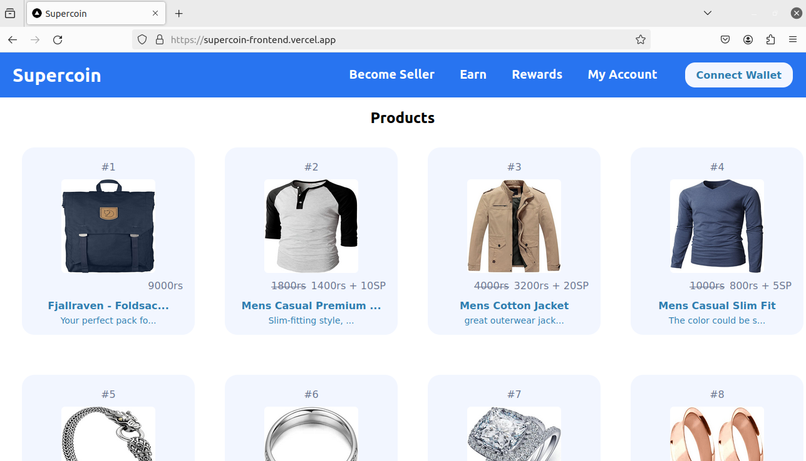
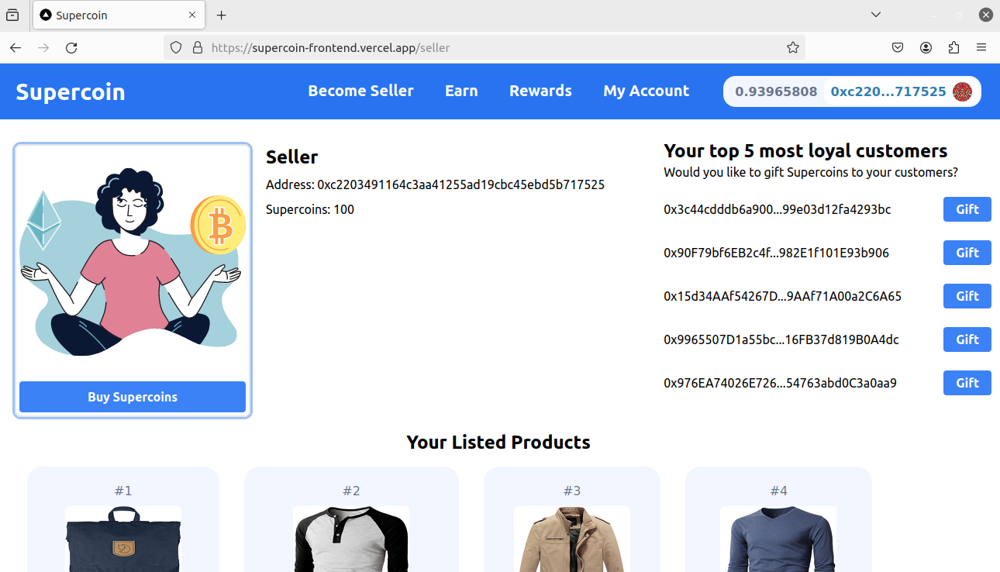
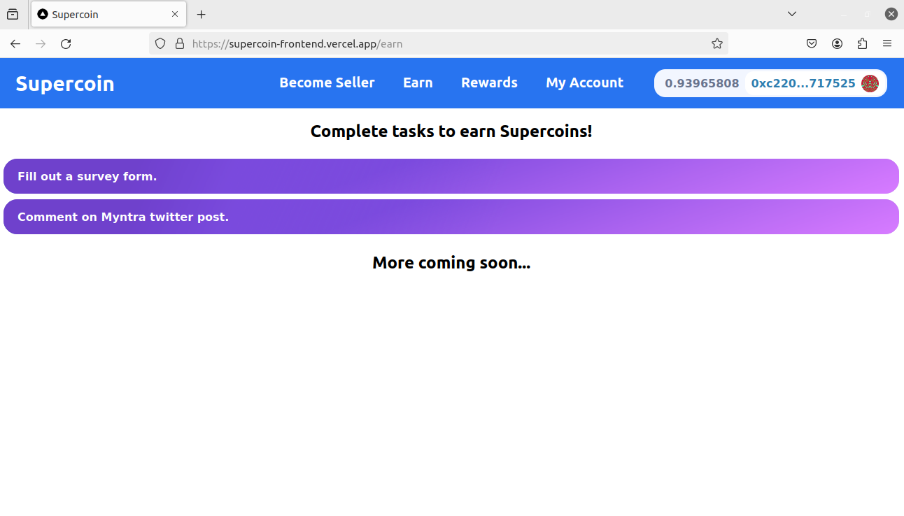
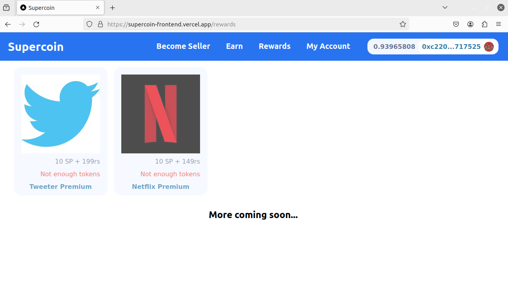
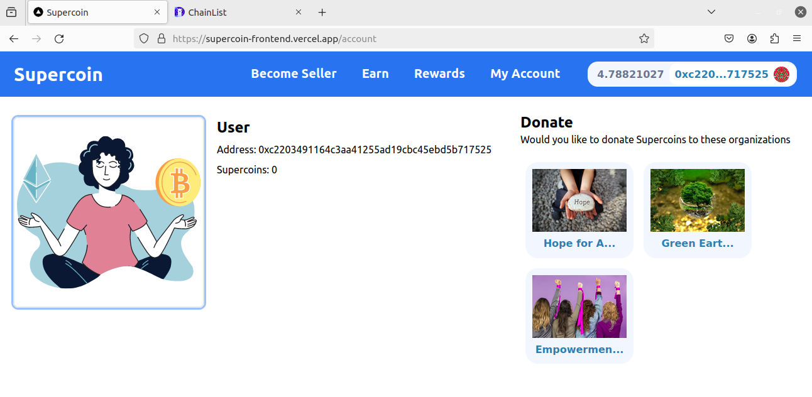

## Supercoin
A blockchain based loyalty and reward program.

Project Live at: [Supercoin](https://supercoin-frontend.vercel.app)

### Working

---

<center><b>Homepage</b></center>

Supercoin homepage, where user can explore the list of available products ready for purchase. User can claim discount on certain products if he/she have enough SP tokens.  



---
<center><b>Seller</b></center>

Supercoin Seller page, Seller can gift SP tokens to their loyal customers, can buy SP tokens in exchange of ETH and can view their listed products. 




---
<center><b>Earn</b></center>

Supercoin Earn page, Users can earn SP tokens by completing some tasks.



---
<center><b>Rewards</b></center>

Supercoin Rewards page, Users can claim certain third-party rewards if they have enough SP tokens. It will be disabled if the user doesn't have enough SP tokens.



---
<center><b>Account</b></center>

Supercoin Account page, Users can view their SP token balance, they can also donate their SP tokens to organizations.



---

### Installation and Running

For backend.
```sh
cd backend
yarn install
yarn start
```

For frontend.
```sh
cd frontend
yarn install
yarn start or yarn dev
```

For hardhat.
```sh
cd hardhat
yarn install
yarn hardhat compile
yarn hardhat test
yarn hardhat deploy
yarn hardhat node (optional)
```